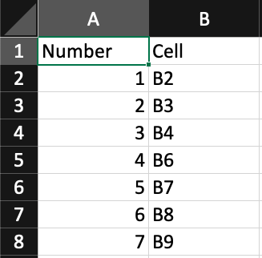
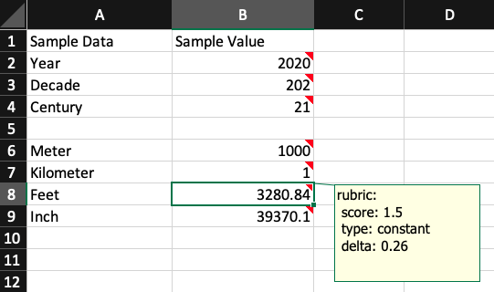

# PySheetGrader

Sections:
1. [What does PySheetGrader do?](#what-does-pysheetgrader-do)
2. [How to setup](#how-to-setup)
3. [How to run](#how-to-run)
4. [Creating a key document](#creating-a-key-document)
5. [Creating a rubric note](#creating-a-rubric-note)
6. [How to setup in Vocareum](#how-to-setup-in-vocareum)
7. [Known issues](#known-issues)
8. [Possible improvements](#possible-improvements)
7. [References](#references)

## What does PySheetGrader do?

PySheetGrader is a grading automation system for spreadsheet-based assignments. Spreadsheets are frequently used in data-oriented courses due to its WYSISWG nature and low learning curve, such as 18657 Decision Analysis for Software Engineers. Grading these assignments manually are tedious and error prone, and PySheetGrader helps the teaching team by automating the grading process.

There are some research that was built for grading or validating spreadsheets, such as Thomas G. Hill's Excel grader [[1](#references)] and Reichwein et al.'s in-app validator [[2](#references)]. However, they are not directly applicable for grading 18657's assignments. Hill's system needs to be run on Windows OS and the website is not available anymore, while Reichwein et al.'s system needs to be run inside spreadsheet app with [Forms/3](http://web.engr.oregonstate.edu/~burnett/Forms3/forms3.html) language. 

PySheetGrader fills the need that cannot be fulfilled by Hill's and Reichwein et al.'s systems: an automated grading system  that can be run on top Linux-based systems with open source dependencies. This is possible due to PySheetGrader's relience on [openpyxl](https://openpyxl.readthedocs.io/en/stable/) for processing spreadsheets and Sympy [[3](#references)] for formula comparison and execution.

Due to the open source and Python-based implementation, PySheetGrader can be deployed into different operating systems and modified as necessary. In the 18657 course, PySheetGrader is deployed to [Vocareum](https://www.vocareum.com), where student can submit their assignment and get their grades automatically.   

## How to setup

Here are the files that need to be copied to make PySheetGrader works:

- `pysheetgrader` directory
- `main.py`
- `requirements.txt`
- `setup.py`
- `setup.sh`

After downloading or cloning this repository, you could run `./setup.sh` as a quick way to install PySheetGrader to your system. Your system needs to have `python3` and `pip` installed.

Otherwise, you could do it manually by executing these steps:

```
python3 -m venv ./venv
source venv/bin/activate
pip install --upgrade pip
pip install -r requirements.txt
pip install -e .
``` 

## How to run

After setting up PySheetGrader, make sure to activate the virtualenv:
```
source venv/bin/activate
```

Then, you can execute the `pysheetgrader` command:

```
pysheetgrader $KEY_DOC_PATH $SUB_DOC_PATH --score-output $SCORE_OUTPUT_PATH --report-output $REPORT_OUTPUT_PATH
```

Arguments of `pysheetgrader` are:

- `KEY_DOC_PATH`: path to the key document, used for grading (an excel spreadsheet with .xlsx extension).
- `SUB_DOC_PATH`: path to the submission document that will be graded (an excel spreadsheet with .xlsx extension).
- `SCORE_OUTPUT_PATH`: path to the file where the grading score will be stored. This is optional, since the score will be shown in the terminal window.
- `SCORE_REPORT_PATH`: path to the file where the detailed report will be stored. This is optional.

There's also the `--verbose` flag that will output the report to the terminal throughout the process.

For example, you could execute the command below to see how it works with a sample spreadsheet:

```
pysheetgrader sample_excel_files/MasterGalleryKey.xlsx sample_excel_files/MasterGallerySubmission.xlsx --verbose
```

## Creating a key document

PySheetGrader will require a key document to run. A proper *.xlsx key document should have these specifications:

1. A sheet named `SheetGradingOrder`, which contains the order of the sheets that needs to be graded on the B column, starting from row 2.
2. For each graded sheet, there should be a pairing sheet with name of `[sheet_name]_CheckOrder`, which contains the order of the cells that needs to be graded on the B column, starting from row 2.
3. An Excel cell note, called rubric note, for each graded cell that contains a rubric specification to grade that cell. The details of the rubric note will be provided in the next section.

Here are some sample images:

- SheetGradingOrder content:


- CheckOrder sheet content (in this case, it's `Constant Samples_CheckOrder`):



- Rubric note of one of the graded cells, as an Excel note attached to cell B8 of Constant Samples:



The complete sample of a key document is available on the [MasterGalleryKey.xlsx](sample_excel_files/MasterGalleryKey.xlsx).

## Creating a rubric note

Rubric notes of a cell are written in YAML format. It consists of mandatory section called `rubric` and optional sections: `alt_cells` and `test_cases`.

### Rubrics

The `rubric` section consists of two children:

1. `score`, which contains a score (integer or float) that will be awarded when the graded cell is correct in the submission sheet. 
2. `type`, which determines how this cell will be graded. There are two options: 
    - `constant`, which will only compare the computed value of the corresponding submission sheet cell to the computed value of this cell. Will utilize the `delta`, if any.
    - `formula`, which will compare the formula of the corresponding submission sheet cell to the formula given in this cell.
    - `test`, which will run the formula of the submission sheet cell against the test cases.
3. `delta`, which will be used as the precision value of the expected value. Will only work for `constant` type.
    - There are `delta` for test cases too, which will be explained on the `test_cases` section. 

### Alternative cells

The `alt_cells` section consists of an array of cell coordinates inside the key sheet. The given cell coordinates will be used as alternative value for `constant` type rubrics or alternative formula for the `formula` type rubrics. This will be useful if a single cell might have different formula or value as an answer. Here's a sample rubric with alternative cells, in cell H5 of the key:

```
rubric:
 score: 1
 type: formula 
alt_cells:
 - P5
 - Q5
 - R5
```

Here PySheetGrader will compare the formula of the submission and key in the cell H5 first. If the formulas don't match, PySheetGrader will compare submission's H5 formula against the key's P5, Q5, and R5 formulas in that order. If any of them matches the submission formula, the submission formula will be considered as a correct answer.

### Test cases

The `test_cases` section will hold the test cases to run against the submission sheet cell's formula. It consist of test case name, which will hold three keys: `input`, `output`, and the optional `delta`. As the name mentions, this will only work with `test` rubric types.

Here's a sample use case. In the [MasterGalleryKey.xlsx](sample_excel_files/MasterGalleryKey.xlsx), cell `B5` of the `Test Case Samples` sheet has this formula:

```
= ROUNDUP(B2 / 100, B4)
```

The corresponding excel sheet for submission, [MasterGallerySubmission.xlsx](sample_excel_files/MasterGallerySubmission.xlsx), has this formula for the same cell and sheet:

```
= ROUNDUP(B2 * 0.01, B4)
```

Although both inherently similar, Sympy didn't regard both as similar due to use of custom formula (`ROUNDUP`) and difference in the passed parameter (`B2 / 100` vs `B2 * 0.01`). Using `formula` rubric will make the submission marked as incorrect. However, passing custom values for B2 and B4 to them using the `test` rubric will mark the submission as correct! Here's the sample rubric, taken from the MasterGalleryKey, sheet `Test Case Samples`, cell `B5`:

```
rubric:
 score: 1.5
 type: test
test_cases:
 default_test:
  output: 21
  input:
   B2: 2020
   B4: 0
 custom_rounding_input:
   output: 20.2
   input:
    B2: 2020
    B4: 1
```

PySheetGrader will also print the test case name in the report output (or the terminal, if ran with `--verbose` flag). Here's a sample output for the sheet:

```
Grading for sheet: Test Case Samples
	- Cell B5, test case runs.
		Test cases:
		- default_test: PASS
		- custom_rounding_input: PASS
	Score: 1.5 / 1.5
	- Cell B9, test case runs.
		Test cases:
		- default_test: PASS
	Score: 1.5 / 1.5
	- Cell B10, test case runs.
		Test cases:
		- default_test: PASS
	Score: 1.5 / 1.5
```

A single test case might also have `delta` for its output. Here's a sample rubric with test case that uses delta, taken from cell `B9` of the `Test Case Samples` sheet:

```
rubric:
 score: 1.5
 type: test
test_cases:
 default_test:
  output: 3280.84
  delta: 0.26
  input:
   B7: 1000
```

Based on the rubric above, the submission will be regarded as right if the output falls between `3280.58` to `3281`.

## How to setup in Vocareum

Running PySheetGrader in Vocareum could be tricky. PySheetGrader relies on other Python packages (e.g., `sympy` and `openpyxl`) and Vocareum seems to have different user levels, which makes it hard for installing a package once and reusing it at other user levels.
However, a fresh PySheetGrader installation will only take one to two minutes, which considered to be acceptable for a single student's submission. 

Here are the general steps on setting up PySheetGrader in Vocareum to make it usable for the students in an assignment:

1. Teacher sets up PySheetGrader inside Vocareum's teacher workspace 
2. Teacher compiles PySheetGrader to installable wheel package 
3. Teacher copies shared Vocareum scripts to corresponding folder in Vocareum workspace 
4. Teacher copies shared assignment files to Vocareum's assignment folder
5. Teacher set up variables in the configuration file for the assignment
6. Teacher uploads the key spreadsheet for the assignment to Vocareum's assignment folder
7. Student uploads the submission spreadsheet to their workspace

Here are the details for each step above:

### 1. Set up the teacher's workspace

1. Zip the necessary files to run PySheetGrader by executing `./vocareum_scripts/zip_for_vocareum.sh` from the root folder. This will generate `pysheetgrader-vocareum.zip`.
2. Upload `pysheetgrader-vocareum.zip` to `resource/lib` in Vocareum's teacher workspace.
3. In the Vocareum's terminal, go to the uploaded directory by executing `cd $LIB/pysheetgrader-vocareum`.
4. Execute `./setup.sh` to set up the virtual environment.

### 2. Compile PySheetGrader (teacher)

Right after setting up the workspace, we need to execute `./vocareum_scripts/teacher/package_for_students.sh`. This script will create an installable *.whl file in the `pysheetgrader-vocareum` folder and copy it to `student_installer` folder at the root level. It will also copy the `requirements.txt` file to the folder, which contains the Python dependencies to be installed later. The contents of `student_installer` will be used for installing PySheetGrader at the student level.

The compilation process needs to be done on Vocareum to make sure the grader is compiled for the execution environment Vocareum uses, which will be different from that of a local platform.

### 3. Copy shared Vocareum scripts (teacher)

In the `vocareum_scripts` folder, there's a folder named `shared_scripts`. Please copy the contents of each script to the corresponding filename in Vocareum workspace's `scripts` folder.

### 4. Copy configuration file (teacher)

In the `vocareum_scripts` folder, there's a folder named `assignments`. Please copy the folder's contents to the `asnlib` folder in the workspace.

### 5. Configure assignment variables (teacher)

In the `pysheetgrader.config` of the `asnlib` folder (copied from previous step), there's variable called `ASSIGNMENT_PREFIX`. Please set up the value of the variable to be used for the key and submission file in this assignment.

### 6. Upload the key Excel document (teacher)

The `submit.sh` script will take an excel file named `[ASSIGNMENT_PREFIX]Key.xlsx` in the `asnlib` folder. Please upload your key Excel file to the `asnlib` folder and rename it correspondingly. For example, if the `ASSIGNMENT_PREFIX` value is `A1` in the config file, the key spreadsheet should be named as `A1Key.xlsx`.

### 7. Uploads the submission Excel document (student)

The student needs to upload their `*.xlsx` file to the root folder of their workspace and rename it to `[ASSIGNMENT_PREFIX]Submission.xlsx`. The `submit.sh` will take the submitted file and compare it to the corresponding key file. For example, if the `ASSIGNMENT_PREFIX` value is `A1` in the config file, the submission spreadsheet should be named as `A1Submission.xlsx`.

## Known issues

There are some known issues for current version of PySheetGrader:

1. **Use plain text for writing the rubric note.** Excel's note are capable for rich text and it will hamper the rubric parsing process. When writing a new note, it is possible for us to just write plain YAML text - but copy and pasting from a rubric to another might end up copying the formatting information too. It is recommended to copy the original rubric note to a plain text editor (e.g., Sublime Text or VSCode), then re-copy the rubric to a new note.
2. **Inability to parse other sheet references.** Currently, PySheetGrader can only parse a formula that refers the cells within the same sheet. It might break if it parses a cell that refers another sheet. To implement this function, we might to find the proper representation of another sheet in a formula. Please update the `parse_formula()` method in `formula_parser.py` when it is ready to be updated.  
3. **Limited support for running Excel formulas.** By default, PySheetGrader will be able to do naive unknown formula comparison using Sympy, but there are cases where we need to rely on unit tests. To do so, we need to add custom implementation of Excel formulas through the `get_excel_formula_lambdas()` method inside the `pysheetgrader/custom_excel_formula.py`. The file provides currently-implemented sample methods and references to do so.

## Possible improvements

There are some features that could be explored further for future versions:

1. **Handling cell shifts in submitted spreadsheets.** Current version of PySheetGrader assumes students' submission will use a certain templates and didn't move them around. To implement this, we might need to find a way to automatically find cell shifting between two sheets. After figuring out the automatic shift detector, we could recover the submitted cells to the original range by utilizing [openpyxl's move_range() method](https://stackoverflow.com/a/61908728/1448626).
2. **Add comparison feature.** It is common to find assertion or comparison feature in unit test frameworks, such as finding equality or inequality. One could say that current PySheetGrader's implementation only supports the equality part. Perhaps there are needs to add a feature to do different type of comparison and a way to state it in the rubric note, e.g., not equal, greater than, or less than.
3. **Add automated unit testing.** Currently all the tests for making sure PySheetGrader works correctly are done manually. To help future maintainers, it is desirable to have automated unit testing for positive, negative, and edge cases to ensure all feature works correctly after new changes.
 
## References

1. Thomas G. Hill. 2004. Excel grader and access grader. SIGCSE Bull. 36, 2 (June 2004), 101–105. DOI: https://doi.org/10.1145/1024338.1024382
2. James Reichwein, Gregg Rothermel, and Margaret Burnett. 2000. Slicing spreadsheets: an integrated methodology for spreadsheet testing and debugging. In Proceedings of the 2nd conference on Domain-specific languages (DSL '99). Association for Computing Machinery, New York, NY, USA, 25–38. DOI: https://doi.org/10.1145/331960.331968
3. Meurer A, Smith CP, Paprocki M, Čertík O, Kirpichev SB, Rocklin M, Kumar A, Ivanov S, Moore JK, Singh S, Rathnayake T, Vig S, Granger BE, Muller RP, Bonazzi F, Gupta H, Vats S, Johansson F, Pedregosa F, Curry MJ, Terrel AR, Roučka Š, Saboo A, Fernando I, Kulal S, Cimrman R, Scopatz A. (2017) SymPy: symbolic computing in Python. PeerJ Computer Science 3:e103 https://doi.org/10.7717/peerj-cs.103