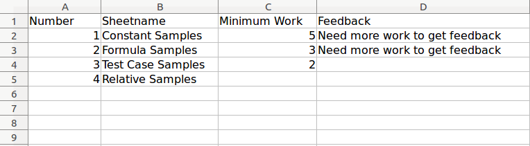

# PySheetGrader 

Blog: https://se-edu.org/auto-grading-spreadsheet-assignments/

[](https://forthebadge.com)

[](https://shields.io/)

Sections:
1. [What does PySheetGrader do?](#what-does-pysheetgrader-do)
2. [How to setup](#how-to-setup)
3. [How to run](#how-to-run)
4. [Creating a key document](#creating-a-key-document)
5. [Creating a rubric note](#creating-a-rubric-note)
6. [How to setup in Vocareum](#how-to-setup-in-vocareum)
7. [Known issues](#known-issues)
8. [Possible improvements](#possible-improvements)
7. [References](#references)

## What does PySheetGrader do?

PySheetGrader is a grading automation system for spreadsheet-based assignments. Spreadsheets are frequently used in data-oriented courses due to its WYSISWG nature and low learning curve, such as 18657 Decision Analysis for Software Engineers. Grading these assignments manually are tedious and error prone, and PySheetGrader helps the teaching team by automating the grading process.

There are some research that was built for grading or validating spreadsheets, such as Thomas G. Hill's Excel grader [[1](#references)] and Reichwein et al.'s in-app validator [[2](#references)]. However, they are not directly applicable for grading 18657's assignments. Hill's system needs to be run on Windows OS and the website is not available anymore, while Reichwein et al.'s system needs to be run inside spreadsheet app with [Forms/3](http://web.engr.oregonstate.edu/~burnett/Forms3/forms3.html) language. 

PySheetGrader fills the need that cannot be fulfilled by Hill's and Reichwein et al.'s systems: an automated grading system  that can be run on top Linux-based systems with open source dependencies. This is possible due to PySheetGrader's relience on [openpyxl](https://openpyxl.readthedocs.io/en/stable/) for processing spreadsheets and Sympy [[3](#references)] for formula comparison and execution.

Due to the open source and Python-based implementation, PySheetGrader can be deployed into different operating systems and modified as necessary. In the 18657 course, PySheetGrader is deployed to [Vocareum](https://www.vocareum.com), where student can submit their assignment and get their grades automatically.   

## How to setup

Here are the files that need to be copied to make PySheetGrader works:

- `pysheetgrader` directory
- `main.py`
- `requirements.txt`
- `setup.py`
- `setup.sh`

After downloading or cloning this repository, you could run `./setup.sh` as a quick way to install PySheetGrader to your system. Your system needs to have `python3` and `pip` installed.

Otherwise, you could do it manually by executing these steps:

```
python3 -m venv ./venv
source venv/bin/activate
pip install --upgrade pip
pip install -r requirements.txt
pip install -e .
``` 

## How to run

After setting up PySheetGrader, make sure to activate the virtualenv:
```
source venv/bin/activate
```

Then, you can execute the `pysheetgrader` command:

```
pysheetgrader $KEY_DOC_PATH $SUB_DOC_PATH --score-output $SCORE_OUTPUT_PATH --report-output $REPORT_OUTPUT_PATH --html-report-output $HTML_REPORT_OUTPUT_PATH
```

Arguments of `pysheetgrader` are:

- `KEY_DOC_PATH`: path to the key document, used for grading (an excel spreadsheet with .xlsx extension).
- `SUB_DOC_PATH`: path to the submission document that will be graded (an excel spreadsheet with .xlsx extension).
- `SCORE_OUTPUT_PATH`: path to the file where the grading score will be stored. This is optional, since the score will be shown in the terminal window.
- `SCORE_REPORT_PATH`: path to the file where the detailed report will be stored. This is optional.
- `HTML_REPORT_OUTPUT_PATH_`: path to the html file where a tabulated HTML report will be stored. This is optional.

There's also the `--verbose` flag that will output the report to the terminal throughout the process.

For example, you could execute the command below to see how it works with a sample spreadsheet:

```
pysheetgrader sample_excel_files/MasterGalleryKey.xlsx sample_excel_files/MasterGallerySubmission.xlsx --verbose
```

## Creating a key document

PySheetGrader will require a key document to run. A proper *.xlsx key document should have these specifications:

1. A sheet named `SheetGradingOrder`, which contains the order of the sheets that needs to be graded on the B column, starting from row 2.
2. For each graded sheet, there should be a pairing sheet with name of `[sheet_name]_CheckOrder`, which contains the order of the cells that needs to be graded on the B column, starting from row 2.
3. An Excel cell note, called rubric note, for each graded cell that contains a rubric specification to grade that cell. The details of the rubric note will be provided in the next section.

Here are some sample images:

- SheetGradingOrder content:


- CheckOrder sheet content (in this case, it's `Constant Samples_CheckOrder`):


- Rubric note of one of the graded cells, as an Excel note attached to cell B8 of Constant Samples:


The complete sample of a key document is available on the [MasterGalleryKey.xlsx](sample_excel_files/MasterGalleryKey.xlsx).

## Creating a rubric note

Rubric notes of a cell are written in YAML format. It consists of mandatory section called `rubric` and optional sections: `alt_cells` and `test_cases`.

### Rubrics

The `rubric` section consists of these parts:

1. `score` (an integer or float), which contains a positive value that will be awarded when the graded cell is correct in the submission sheet or contains a negative value that will be deducted when the graded cell is incorrect in the submission sheet. 
2. `type`, which determines how this cell will be graded. There are two options: 
    - `constant`, which compares the evaluated value of the corresponding submission sheet cell to the evaluated value of the key cell. Will utilize the `delta`for precision, if specified for cells with numeric values.
    - `formula`,  which compares the formula of the corresponding submission sheet cell to the formula given in this cell.
    - `test`, which evaluates the formula of the submission sheet cell against the test cases.
    - `soft_formula`, which requires the submission cell to be a formula, but otherwise performs the comparison with evaluated values as in the `constant` rubric type.
    - `relative` or `relative_f`, which evaluates the formula in the key cell using values from the submission cells and compares the result to the value in the submission cell. 
3. `delta`, which specifies precision in numeric value comparisons. Will only work with non-formula rubric types when they check numeric calculations; e.g., `constant`, `relative`, `relative_f`, `soft_formula`, and `test` (inside individual test cases) rubric types. 
4. `grading`, which is used to allow negative grading:
   - `positive` (default value): if the calculation is correct according to the specified rubric type, then the points specified in the `score` attribute is awarded for the cell, and no feedback is given (green row in the HTML report). Otherwise, no points are awarded and the specified feedback is given (red row in HTML report). If `grading` is unspecified, it is assumed to be `positive`. The rubric's `score` attribute must have a positive value. 
   - `negative`: if the calculation is correct according to the specified rubric type, then no points are deducted, no feedback is given (green row in the HTML report), and the cell gets the maximum score of 0. Otherwise, the cell receives the negative points specified in the `score` attribute, which are deducted from the total grade, and the specified feedback is given (red row in HTML report). The rubric's `score` attribute must have a negative value, indicating a deduction or penalty. 

### Alternative cells

The `alt_cells` section consists of an array of cell coordinates inside the key sheet. The given cell coordinates will be used as alternative value for `constant` type rubrics or alternative formula for the `formula` type rubrics. This will be useful if a single cell might have different formula or value as an answer. Here's a sample rubric with alternative cells, in cell H5 of the key:

```
rubric:
 score: 1
 type: formula 
alt_cells:
 - P5
 - Q5
 - R5
```

Here PySheetGrader will compare the formula of the submission and key in the cell H5 first. If the formulas don't match, PySheetGrader will compare submission's H5 formula against the key's P5, Q5, and R5 formulas in that order. If any of them matches the submission formula, the submission formula will be considered as a correct answer.

### Test cases

The `test_cases` section will hold the test cases to run against the submission sheet cell's formula. It consist of test case name, which will hold three keys: `input`, `output`, and the optional `delta`. As the name mentions, this will only work with `test` rubric types.

Here's a sample use case. In the [MasterGalleryKey.xlsx](sample_excel_files/MasterGalleryKey.xlsx), cell `B5` of the `Test Case Samples` sheet has this formula:

```
= ROUNDUP(B2 / 100, B4)
```

The corresponding excel sheet for submission, [MasterGallerySubmission.xlsx](sample_excel_files/MasterGallerySubmission.xlsx), has this formula for the same cell and sheet:

```
= ROUNDUP(B2 * 0.01, B4)
```

Although both inherently similar, Sympy didn't regard both as similar due to use of custom formula (`ROUNDUP`) and difference in the passed parameter (`B2 / 100` vs `B2 * 0.01`). Using `formula` rubric will make the submission marked as incorrect. However, passing custom values for B2 and B4 to them using the `test` rubric will mark the submission as correct! Here's the sample rubric, taken from the MasterGalleryKey, sheet `Test Case Samples`, cell `B5`:

```
rubric:
 score: 1.5
 type: test
test_cases:
 default_test:
  output: 21
  input:
   B2: 2020
   B4: 0
 custom_rounding_input:
   output: 20.2
   input:
    B2: 2020
    B4: 1
```

PySheetGrader will also print the test case name in the report output (or the terminal, if ran with `--verbose` flag). Here's a sample output for the sheet:

```
Grading for sheet: Test Case Samples
	- Cell B5, test case runs.
		Test cases:
		- default_test: PASS
		- custom_rounding_input: PASS
	Score: 1.5 / 1.5
	- Cell B9, test case runs.
		Test cases:
		- default_test: PASS
	Score: 1.5 / 1.5
	- Cell B10, test case runs.
		Test cases:
		- default_test: PASS
	Score: 1.5 / 1.5
```

A single test case might also have `delta` for its output. Here's a sample rubric with test case that uses delta, taken from cell `B9` of the `Test Case Samples` sheet:

```
rubric:
 score: 1.5
 type: test
test_cases:
 default_test:
  output: 3280.84
  delta: 0.26
  input:
   B7: 1000
```

Based on the rubric above, the submission will be regarded as right if the output falls between `3280.58` to `3281`.

## Rubric Types
### Soft Rubric Type
The rubric type `soft_formula` evaluates the key cell as follows:
1) If the cell does not contain a formula, no credit is given.
2) If the cell contains a formula, grade it like a constant rubric type (compare cell's evaluated result to key's evaluated result, ignoring the formulas). 
For example, for a given cell the key expects the answer 0.5 using the formula `0.1* B2`. In this case, under the `soft_formula` rubric, the grader checks the submission cell if contains a formula or not. If the formula is present (even if it is not equivalent to the key cell's formula), it assigns grade based on the actual cell value. So, if the submission cell evaluates to 0.5 through theformula`0.6*B3`, the student still gets full credit.

### Relative Formula Type
Relative formulas are now possible with two rubric types:  `relative` or `relative_f`.

* `relative` compares the evaluation of key's formula using the **submission cells values** (the actual values of the key cells referenced in the submission cell). For example, suppose the cell A1 in `A1Key.xlsx` contains a formula `=IF(A2 = "ok", B2, C2)`. Inside the student submission, suppose A1 contains 13, A2 contains "not_ok", B2 contains 13, and C2 contains 14. The instructor's formula will be evaluated with the student submission's cells, which gives a value of 14. This evaluated answer will be checked against the submission's evaluated A1 cell value, which is 13. In this case, A1 doesn't pass the rubric (the actual value is 13, but the expected value is 14).  

* `relative_f` is a stricter version of `relative` rubric. It grades like the `relative`, but additionally it requires the evaluated submission cell to be a formula. If the evaluated cell is a hardcoded constant, the student will not get a score. In the above example, even if the student's A1 contains a hardcoded value 14, the rubric still doesn't pass.

As a side note, both `relative` and `relative_f` supports the `delta` and `alt_cells` rubric modifiers for flexibility.

## Minimum Work feature
This feature allows the instructor to specify the minimum score for every sheet and corresponding message in the SheetGradingOrder sheet.
So, if for any sheet, a student scores less than the minimum value, the student does not get the feedback for questions answered in that sheet. The student instead receieves a message in the report saying "Need more work to recieve a grade". 

Below is an example of the SheetGradingOrder sheet: 


If there is no minimum threshold for any sheet, in that case, 0 is used as the default threshold.

## Failure Message for Failed Test Cases
This feature allows us to provide a specialized, optional failure message per test case in the test_cases rubric. They can be used to give a useful clue without giving the answer, in the same manner as unit test failure messages.

Example:

A message could be "if cell A1 = 5 and A2 = 3, this cell value should be 8, but was 3!".

Without failure message:

```
rubric:
 score: 2
 type: test
test_cases:
 t1:
  output: 3280.84
  delta: 0.1
  input:
   B7: 1000
   B8: 25
```

With failure message:

```
rubric:
 score: 2
 type: test
test_cases:
 t1:
  output: 3280.84
  delta: 0.1
  input:
   B7: 1000
   B8: 25
  fail: "When B7 is $B7 and B8 is $B8, this cell should be $expected, but was $actual!"
```

If the t1 fails, this message is printed next to in sub report next to the failure. The $ variables refer to input cells, the output cell (expected) and the actual evaluated value (actual). 
So, in the above example, the output message will be: When B7 is 1000 and B8 is 25, this cell should be 3280.84, but was 2025.34!
Also, it is important to be careful about indentation while creating this rubric. fail should have the same indentation as input, output and delta. 

## Sub sheet total
This feature provides subtotals for each sheet in the SheetGradingOrder sheet. It provides the output as the subtotal for each sheet followed by total score for all sheets.

```
Sheet1
Total: xx / yy

Sheet2
Total xx / yy

Assignment Score: << grand total of all subtotals >>
```

## Hidden cells

Some cells can be graded secretively, with student feedback indicating that something went wrong in that cell without specifing which cell caused the problem. In the CheckOrder sheet of a graded tab, there is a decidaced column titled "Hidden" to indicated this. Enter H in this column if the cell is to be graded secretively. 

## How to setup or deploy to Vocareum for a new course

### Course-wide setup by instructor

Here are the general steps on setting or updating PySheetGrader in Vocareum for a specific course:

1. Zip files on your local computer with `bash ./vocareum_scripts/zip_for_vocareum.sh` from root. This will generate the file `pysheetgrader-vocareum.zip`.
2. Go to the course and choose any spreadsheet assignment (if none exists, create a new one). 
3. Click on `Edit Assignments` and then `Configure Workspace`. This takes you to the `Teacher View` in the assignment's workspace. 
4. Upload the file `pysheetgrader-vocareum.zip` to the`resource/lib` folder in the assignment's workspace.
5. On Vocareum console, navigate to the vocaruem library directory by executing `cd $LIB/pysheetgrader-vocareum`.
6. Run `./deploy_on_vocareum.sh` in the `$LIB/pysheetgrader-vocareum` directory to run the compilation scripts and copy the necessary files to the right course folders. 

### Assignment-wide setup by instructor

For each assignment, these additional steps are necessary: 

1. In the assignment's workspace, set the value of the variable `ASSIGNMENT_PREFIX` in `resource/asnlib/pysheetgrader.config`. This variable contains the prefix that will be used in naming key, submission, and report files. For example `ASSIGNMENT_PREFIX=My`, then the key file must be named `MyKey.xlsx`, the submission file must be named `MySubmission.xlsx`, and the HTML report file will be named `MyReport.html`.   
2. Upload key file to the folder `resource/asnlib`. The key file must be named `[ASSIGNMENT_PREFIX]Key.xlsx`. 
3. Copy the `submit.sh` script into the assignment's `scripts` folder from the `/lib/pysheetgrader-vocareum/vocareum_scripts/shared_scripts` folder (or just copy and paste contents into the file `resource/scripts/submit.sh`).
4. To deploy the changes to the students, click on the `Update*` button. Otherwise changes will be available only for the instructor for testing. 
   
### To test a new deployment or update 

#### Teacher View 

1. Go to the assignment's workspace (`Edit Assignments > Configure Workspace`).
2. Upload the submission file `[ASSIGNMENT_PREFIX]Submission.xlsx` to the `work` subfolder. 
3. Run the submission script by selectiong `Submission` from the `Run Scripts` drop-down tab. 
4. Wait for the submission script to complete. This may take several minutes. 
5. Check standard output on consolde and the generated reports and grade file under the `work` subfolder: vocStudentSubmissionReport.txt, vocSubmissionReport.txt, vocareum_report.txt, `[ASSIGNMENT_PREFIX]Report.xlsx`, vocareum_grade.csv.

#### Student View

1. Go to the assignment's workspace (`Edit Assignments > Configure Workspace`), and then click on `Student View`. This view emulates what the students see when they are submitting the assignment. 
2. Upload the submission file `[ASSIGNMENT_PREFIX]Submission.xlsx` to the `work` subfolder. 
3. Run the submission script by hitting the `Submit` button. 
4. Wait for the submission script to complete. When ready, the submission report can be viewed from the `Details` drop-down tab. This may take several minutes. 
5. Check the submission report (`Details > View Submission Report`) and the generated HTML report under the `work` subfolder. 


#### Using a student account

The surest way to test the setup and new deployment after publishing an assignment on Vocareum is by creating a mock student account and logging in as a student to Vocareum and submitting the assignment. 

_The deprecated setup instruction is [here](./doc/how_to_setup_in_vocareum_deprecated.md)_

## Known issues

1. **Use striclty plain text for entering a rubric note.** Excel's cell notes support rich text, and using rich text in rubric notes will crash the rubric parsing process. When writing a new rubric note, by default you will enter plain YAML text, however sometimes Excel will automatically add the author in rich text. Also be careful with copy-paste: copying the rubric content from an external text editor or another spreadsheet cell and pasting it into a new rubric note may also copy any rich-text formatting. When this happens, try coping the rubric content to a plain text editor (e.g., Sublime Text or VSCode) first, delete the faulty rubric note, create a new rubric note, then copy the content back from the plain text editor to the new rubric note. These other strategies also work: (A) to clone a correclty typeset rubric note in another cell, simply copy the cell in Excel and use `Edit > Paste Special > Comments` onto the other cell, which copies the cell note as well as comments, without copying the actual cell contents. Caution: If you add a rubric with `Right-Click > New Note`, the author, if defined, is by default typset in bold (rich text), so make sure to completely zap this rich-text part otherwise the rubric will not work. Deleting the author simply by backspacing here may not work, and instead the whole rubric may end up being typset in bold!
 

## Possible improvements

There are some features that could be explored further for future versions:

1. **Handle cell shifts in submitted spreadsheets.** Current version of PySheetGrader assumes students' submission will use a certain templates and didn't move them around. To implement this, we might need to find a way to automatically find cell shifting between two sheets. After figuring out the automatic shift detector, we could recover the submitted cells to the original range by utilizing [openpyxl's move_range() method](https://stackoverflow.com/a/61908728/1448626).
2. **Add comparison feature.** It is common to find assertion or comparison feature in unit test frameworks, such as finding equality or inequality. One could say that current PySheetGrader's implementation only supports the equality part. Perhaps there are needs to add a feature to do different type of comparison and a way to state it in the rubric note, e.g., not equal, greater than, or less than.
3. **Add automated unit testing.** Currently all the tests for making sure PySheetGrader works correctly are done manually. To help future maintainers, it is desirable to have automated unit testing for positive, negative, and edge cases to ensure all feature works correctly after new changes.
4. **Add fallback rubric types.** There are some discussions about using test cases when formula comparison is not enough, but current version only allows one rubric type for a cell. We might need to figure out how to define a clean, readable rubric to implement the feature.
5. **Handle test case runs with different cell references.** Current test case runs only work when the submission cells when the cell references in the formula are defined in the rubric. There might be cases where the cell formula includes cell reference that is not defined in the rubric, and we need to do some sort of detection or replacement algorithm to do handle it properly. Or perhaps, one might tackle this from the perspective of mathematical formula definition.
6. **Vocareum: Add automated script for copying `shared` folders inside `vocareum_scripts`.** Currently, the content of `shared_scripts` and `shared_asnlib` needs to be copied manually. It is possible to do this through executing shell scripts, but it might need quite some time to do it in clean and proper manner - knowing Vocareum's access privilege might differs on their future updates. NOTE: see item 9 instead. 
7. **Vocareum: Suppress output in Submission Report as well as Vocareum console not meaningful to students or that should not be visible to students.** There is some console output produced that is visible to students. This is cryptic and not very meaningful, and should probably be suppressed. Also in Submission report the grading report is printed twice. Clean up the output shown to the student. 
8. **Vocareum: Move submission script to lib folder.** The submission script should be moved to lib folder and just be a one-liner that calls the script from the lib folder (as was done in model-checking and unit testing assignments). This will avoid copying and pasting it for new assignments and allow any improvements to be done once in the lib folder and automatically propogated to all assignments. 
9. **Improve error handling and reporting.** Right now when something goes wrong, it's not possible to figure out where the mistake happenned. This should be much improved with specific information for, e.g., when a rubric is syntactically wrong, when a graded cell doesn't have a rubric, etc. There could be a sanity-check process before deploying for just vefiying that the key file is correct with all the mistakes listed with descriptive error messages for easy correction. Another example is, if a cell is to graded in CheckOrder sheet, but there is no rubric, this should be reported.  
10. **Vocareum: Improve performance.** Right now each submission takes 1.5-3 minutes to run. There is a lot of setup involved in the student's workspace before the grading script can run. Can this be improved? 
12. **Better feedback to students.** Right now feedback to student is rudimentary, too generic, and not specific enough to be useful. This could be improved, for example by allowing custom, more meaningfule and actionable feedback messages in the rubrics when a student cell provides the wrong answer so that the student has a way of improving the solution. In test case and formula rubrics, the cells that should be involved in the formula or test cases could be specified. 
13. **Better and comprehensive testing.** We need a comprehensive test suite to test all features and corner cases, as well as error reporting. 
 
## References

1. Thomas G. Hill. 2004. Excel grader and access grader. SIGCSE Bull. 36, 2 (June 2004), 101–105. DOI: https://doi.org/10.1145/1024338.1024382
2. James Reichwein, Gregg Rothermel, and Margaret Burnett. 2000. Slicing spreadsheets: an integrated methodology for spreadsheet testing and debugging. In Proceedings of the 2nd conference on Domain-specific languages (DSL '99). Association for Computing Machinery, New York, NY, USA, 25–38. DOI: https://doi.org/10.1145/331960.331968
3. Meurer A, Smith CP, Paprocki M, Čertík O, Kirpichev SB, Rocklin M, Kumar A, Ivanov S, Moore JK, Singh S, Rathnayake T, Vig S, Granger BE, Muller RP, Bonazzi F, Gupta H, Vats S, Johansson F, Pedregosa F, Curry MJ, Terrel AR, Roučka Š, Saboo A, Fernando I, Kulal S, Cimrman R, Scopatz A. (2017) SymPy: symbolic computing in Python. PeerJ Computer Science 3:e103 https://doi.org/10.7717/peerj-cs.103
