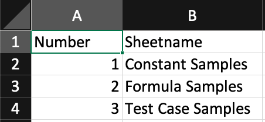

# PySheetGrader

## How to setup

Here are the minimum files that needs to be copied to make PySheetGrader works:

- `pysheetgrader` directory
- `main.py`
- `requirements.txt`
- `setup.py`
- `setup.sh`

You could run `./setup.sh` as a quick way to install PySheetGrader to your system. This will require your system to have `python3` and `pip` installed.

Otherwise, you could do it manually by executing these steps:

```
python3 -m venv ./venv
source venv/bin/activate
pip install --upgrade pip
pip install -r requirements.txt
pip install -e .
``` 

## How to run

After setting up PySheetGrader, make sure to activate the virtualenv:
```
source venv/bin/activate
```

Then, you can call the `pysheetgrader` command:

```
pysheetgrader $KEY_DOC_PATH $SUB_DOC_PATH --score-output $SCORE_OUTPUT_PATH --report-output $REPORT_OUTPUT_PATH --verbose
```

Explanation for each variables:

- `KEY_DOC_PATH`: path to the key document, used for grading.
- `SUB_DOC_PATH`: path to the submission document that will be graded.
- `SCORE_OUTPUT_PATH`: path to the file where the grading score will be stored. This is optional, since the score will be shown in the terminal window.
- `SCORE_REPORT_PATH`: path to the file where the detailed report will be stored. This is optional.

There's also the `--verbose` flag that will output the report to the terminal throughout the process.

## Creating a key document

PySheetGrader will require a key document to run. A proper *.xlsx key document should have these specifications:

1. A sheet named `SheetGradingOrder`, which contains the order of the sheets that needs to be graded on the B column, starting from row 2.
2. For each graded sheet, there should be a pairing sheet with name of `[sheet_name]_CheckOrder`, which contains the order of the cells that needs to be graded on the B column, starting from row 2.
3. Rubric notes for each cell that needs to be graded. The details of a rubric note will be provided on the next section.

Here are some sample images:

- SheetGradingOrder content:



- CheckOrder sheet content (in this case, it's `Sheet3_CheckOrder`):


- Rubric note of one of the graded cell, as a note on cell B6 of Sheet3:


## Creating a rubric note

Rubric notes of a cell are written in YAML format. It consists of two root sections: `rubric` and `unit_tests`.

The `rubric` section consists of two child:

1. `score`, which contains a number that will be awarded to graded documents when they match the key document.
2. `type`, which determines how this cell will be graded. There are two options: 
    - `constant`, which will only compare the computed value of the cell
    - `formula`, which will compare the formula of the graded cell against the key document.

The `unit_tests` section will hold the values that will be used for testing the cell. This will be used only for `formula`-type rubrics.
The details on how to write cell unit tests will be added later.

## How to setup in Vocareum

TODO: Add this later
 